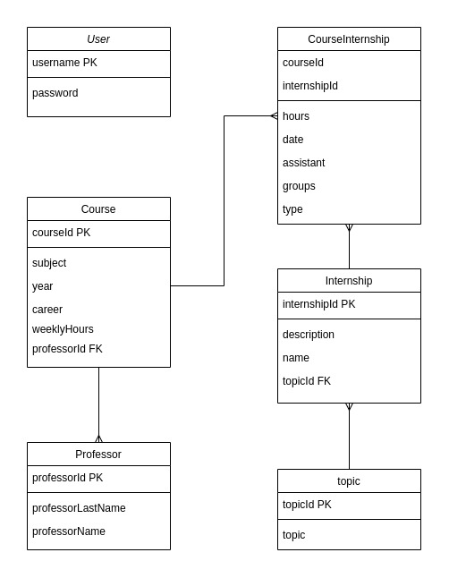

# University register system API

An API using express and sequelizer to manage a very simple university register system. It supports CRUD operations with JWT authentication for every table in the database.

## Database diagram

## Requests

The following are the requests supported by the API listed according to the table.

### Course

[add course request](./requests/courses/addCourse.rest)

[update course request](./requests/courses/updateCourse.rest)

[get course request](./requests/courses/getCourse.rest)

### Internship

[add internship request](./requests/internships/addInternship.rest)

[update internship request](./requests/internships/updateInternship.rest)

[get internship request](./requests/internships/getInternship.rest)

### CourseInternship

[add courseinternship request](./requests/internshipCourse/addInternshipCourse.rest)

[update courseinternship request](./requests/internshipCourse/updateInternshipCourse.rest)

[get courseinternship request](./requests/internshipCourse/getInternshipCourse.rest)

### Professor

[add professor request](./requests/professor/addProfessor.rest)

[update professor request](./requests/professor/updateProfessor.rest)

[get professor request](./requests/professor/getProfessor.rest)

### Topic

[add topic request](./requests/topic/addTopic.rest)

[update topic request](./requests/topic/updateTopic.rest)

[get topic request](./requests/topic/getTopic.rest)

### User

[login user request](./requests/user/userLogin.rest)

[register user request](./requests/user/userRegistration.rest)

## Tools used in this API

* Sequelize
* Express
* JWT library

### NOTE

This was made for an assignment at the Costa Rica institute of Technology. 